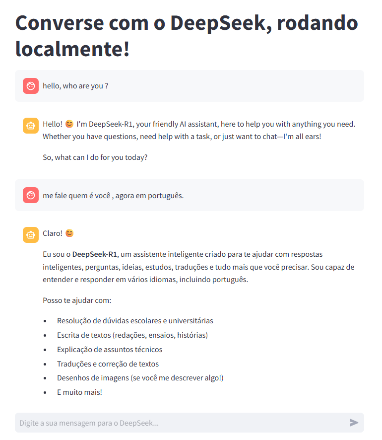

# 🚀 Chat DeepSeek — Rode a IA localmente com Ollama, Streamlit e ngrok  

---

## 💡 Sobre o projeto  

Bem-vindo ao **Chat DeepSeek**, um projeto que mostra na prática como rodar o **modelo DeepSeek** diretamente no seu computador — sem depender de servidores externos e com total controle sobre seus dados.  

Neste guia, você aprenderá a:  

- ⚙️ **Rodar o DeepSeek localmente** utilizando o **Ollama**, uma ferramenta poderosa para gerenciar modelos de IA em sua própria máquina.

- 💬 **Criar uma interface de chat completa e interativa** com **Streamlit**, para conversar com o modelo de forma simples e intuitiva.

  
- 🌐 **Publicar o app na web com o ngrok**, permitindo acesso remoto seguro — até mesmo pelo seu celular.

---

## 🧠 Por que este projeto é importante  

Em um cenário dominado por soluções hospedadas por grandes provedores de IA, este projeto mostra o poder de **rodar modelos avançados localmente** — garantindo:  

- 🔒 **Privacidade total dos dados** (sem envio para nuvens de terceiros);  
- ⚡ **Desempenho otimizado e controle total** sobre o ambiente;  
- 🧰 **Autonomia para experimentar, adaptar e integrar IA** nos seus próprios fluxos de trabalho.  

O **Chat DeepSeek** é ideal para quem quer explorar IA de ponta **sem abrir mão da liberdade técnica**.  

---

## 🧭 O que você vai aprender  

- Instalar e configurar o **Ollama** para rodar o **DeepSeek**;  
- Criar uma **interface de chat responsiva e minimalista** com **Streamlit**;  
- Integrar o **ngrok** para exposição segura do app na web;  
- Entender o **fluxo de execução local e comunicação cliente-servidor**;  
- Compartilhar sua aplicação com o mundo em minutos.  

---

## 🌍 Resultados  

Ao final, você terá um **chat de IA funcional**, rodando **100% localmente**, com **acesso remoto via URL gerada pelo ngrok**.  
Tudo isso com **código aberto**, personalizável e pronto para evoluir conforme suas necessidades.  

---

## 🧑‍💻 Conclusão  

O projeto **Chat DeepSeek** é um convite para quem quer **trazer a IA para dentro de casa — literalmente**.  
É o primeiro passo para uma nova geração de desenvolvedores e entusiastas que desejam **dominar modelos de linguagem de forma independente**, com **segurança, eficiência e propósito**.  

> 🧭 Dê o primeiro passo.  
> ⚙️ Rode o DeepSeek localmente.  
> 🌎 Crie, aprenda e compartilhe com o mundo.  
